# NahiViva (なひビバ)
Vivadoを使っていて、次のような悩みはないですか？

<span style="font-size: 150%;">

**「プロジェクトがVivado 2018.3用なんだけど、わざわざ古いVivadoをスタートメニューから開くのが面倒くさいな」**

**「Vivadoがたくさんあるんだけど、古いのを選んで開くのが面倒」**

**「Update IPの作業って、どうしてこんなに何度も何度もクリックしなきゃいけないの？」**

**「MCSファイルって、どうやって作るんだっけ？？」**

**「gitで管理したいけど、ブロックデザインもプロジェクトもバイナリだから相性が悪いな」**

**「テレワークしようと会社のファイルを家に持って帰ってきたけど、ディレクトリ関係が変わってやりにくい」**

**「そもそもBitStreamってどこにあるの？」**

**「お客さんに300Mバイトのプロジェクトをメールで送ったら怒られた」**

</span>


NahiVivaはそんな悩みを解決する、Vivadoの操作のための便利Tclライブラリです。

主に次のようなことがコマンド一発でできます。

* [論理合成・配置配線の実行](#nahirun)
* [Update-IP作業の自動化](#nahiupdate)
* [SPI-ROM用のMCSファイル生成](#nahigenmcs)
* [Vivadoのバージョンを指定して起動](#howtorun)
* [コメントを利用したIPの一括カスタマイズ](#nahiconfigbycomments)
* [BitStreamを見つけやすいフォルダにコピー](#nahicopybit)
* [Tcl形式でのプロジェクト保存](#nahisave)

# 動作環境
- XILINX Vivado 2017.4 2018.1 2018.2 2018.3 2018.4 2019.1 2019.2 2020.1 2020.2
- Windows 10で動作確認済み (Linuxはまた別途)

# セットアップ
VivadoのXPRファイルがあるフォルダの1つ上のフォルダに、NahiVivaのファイル一式を置きます。  
（少なくともnahiviva.tcl、open_project_gui.cmd、SETTINGS.CMDの3つがあれば動作可能）

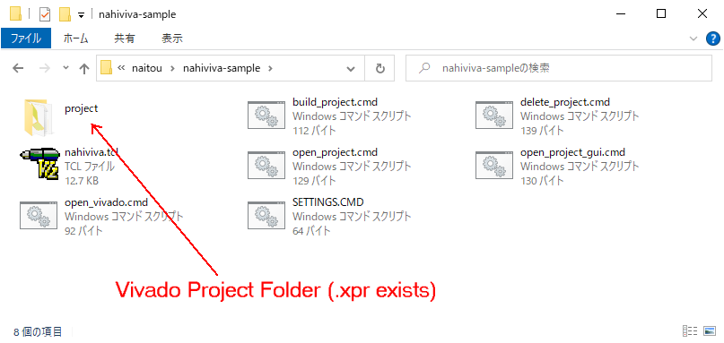
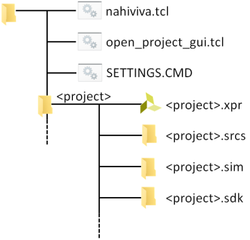

インストールされているVivadoに合わせて、SETTINGS.CMDを編集します。

```SETTINGS.CMD
@SET VIVADO_PATH=D:\Xilinx\Vivado\
@SET VIVADO_VERSION=2019.2
```
ここで設定したパスの、指定したバージョンのVivadoを使用するようになります。


<a id="howtorun"></a>

# 起動方法

open_project_gui.cmdをクリックします。  

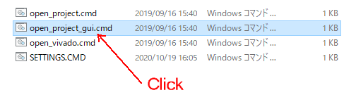

NahiVivaがあるフォルダ配下のフォルダからVivadoのプロジェクトを探します。

最初はコマンドプロンプト版のVivadoが起動し、その後、start_guiコマンドが実行され、GUI版が起動します。

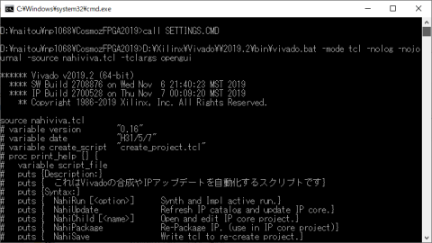

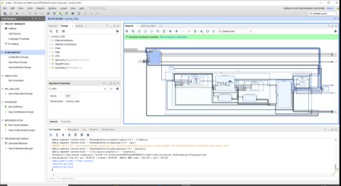


## 動作中のVivadoから読み込む方法

Tclコンソールからsourceコマンドを使って、nahiviva.tclを読み込むこともできます。

ファイルのパスにご注意ください。
```
source ./nahiviva.tcl
```
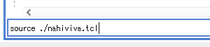

---

# 様々な便利コマンド

VivadoのTclコンソールに以下のコマンドを入力することで、様々な強化機能が使えるようになります。

<a id="nahirun"></a>

## NahiRun　(論理合成・配置配線)

このコマンドは、Vivadoの論理合成を行います。
```
NahiRun [オプション]
```
オプションに-updateを指定した場合は、Update IPの動作を一緒に行います。

オプションに-restartを指定した場合は、論理合成済みであっても、最初から論理合成と配置配線を行います。

オプションに-synthを指定した場合は、論理合成のみ行い、配置配線は行いません。

オプションに-reportを指定した場合は、使用率レポート、タイミングレポート、IOレポートを作成します。   

---

<a id="nahiupdate"></a>

## NahiUpdate (IPのアップデート)

IPコアのソースを変更した場合、IP StatusをしてRunしたりUpdate IPといった一連の操作は面倒ですが、NahiUpdateコマンドを使用するとダイアログを出すことなくUpdate IPの動作をすべて行います。

```
NahiUpdate
```

---

<a id="nahishowallproperty"></a>

## NahiShowAllProperty (プロパティを全部見る)

```
NahiShowAllProperty　[オブジェクト名]
```

オブジェクトにはいろいろなプロパティがあります。具体的に言うと、クロックの配線、特定のプリミティブ、プロジェクトなど、すべてがVivadoで扱うすべてがオブジェクトです。

こういったオブジェクトのプロパティを全部見るのがこのコマンドです。

### 実行例

```
NahiShowAllProperty [get_clocks clk_fpga_0]
CLASS <= clock
FILE_NAME <= d:/naitou/np1068/CosmozFPGA2019/vivado/vivado.srcs/sources_1/bd/cosmoz_main/ip/cosmoz_main_processing_system7_0_0/cosmoz_main_processing_system7_0_0.xdc
INPUT_JITTER <= 0.120
IS_GENERATED <= 0
IS_PROPAGATED <= 1
IS_USER_GENERATED <= 0
IS_VIRTUAL <= 0
LINE_NUMBER <= 20
NAME <= clk_fpga_0
PERIOD <= 4.000
SOURCE_PINS <= cosmoz_main_i/CPU/Core/processing_system7_0/inst/PS7_i/FCLKCLK[0]
SYSTEM_JITTER <= 0.050
WAVEFORM <= 0.000 2.000
```

---

<a id="nahisave"></a>

## NahiSave (アーカイブ保存)

Vivadoのプロジェクトをアーカイブとして保存し、BDやMIG、IPなどのGUI生成オブジェクトも含めてTCL形式で保存します。

```
NahiSave
```

これによってすべてのVivadoプロジェクトがテキスト化されるため、gitでのバージョン管理が容易になります。

アーカイブと復元については別のページに詳しく記載します。

---

<a id="nahiconfigbycomments"></a>

## NahiConfigByComments (コメントからのIPカスタマイズ)

このコマンドは、VivadoのBlock Design上に配置されたコメントを利用して、IPのパラメータを一括変更します。
```
NahiConfigByComments
```

下の図のようにBlock DesignにCONFIGS:で始まるコメントを書きます。

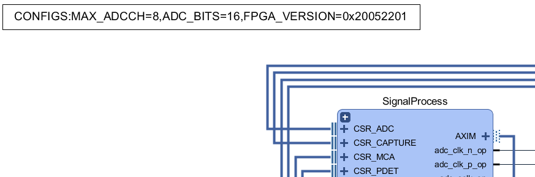

書式は、Key＝Valをカンマでつないでいく単純なものです。

```
CONFIGS:[<Key>=<値>[,<Key>=<値>[,<Key>=<値> ...]]]
```

このパラメータでIPのGeneric文が設定されます。

なお、Vivadoでのコメントの配置方法は、Block Designで右クリックして、Create Commentでできます。

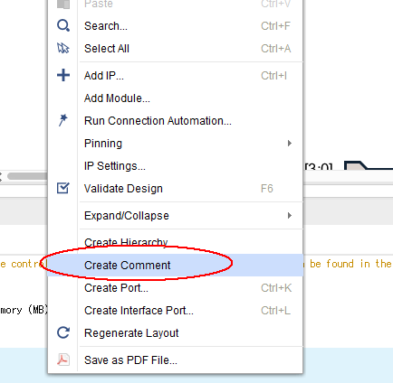

## 応用例

たくさんのIPコアを作っているとカスタマイズが面倒になることが多々あります。例えば、ADコンバータを使った計測システムでは、ADCインタフェースモジュール、ピーク検出モジュール、DMAモジュールなど様々なモジュール間をAXI Stereamでインターフェースするとします。

この場合、ADCの分解能を変更したい場合、すべてのIPのGUI設定画面をひらき、パラメータを変更することになりますが設定漏れがあると論理合成中にエラーとなってしまうでしょう。

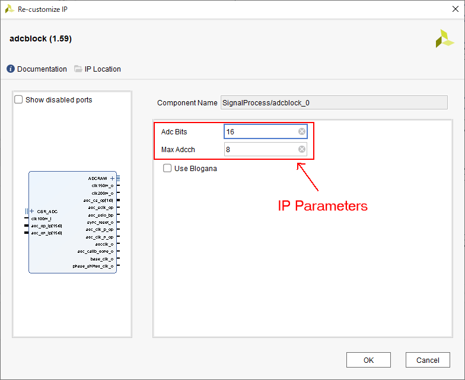

また、FPGAのバージョン番号などをIPにパラメータとして設定した場合、わざわざIPの設定画面を開いて変更するのも面倒です。

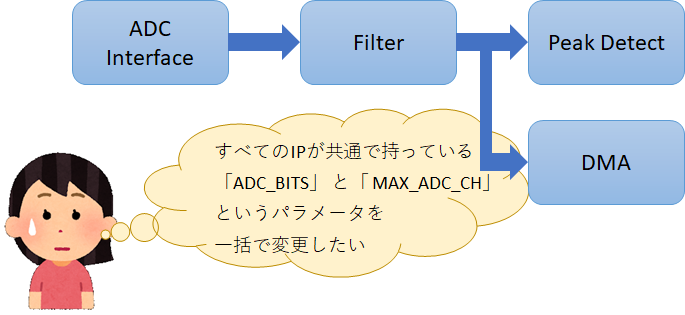

そこで、Vivadoのコメント機能を使ってパラメータを一括で変更できるようにしました。

実行令
```
NahiConfigByComments
ProcessComment:MAX_ADCCH <= 8
change /CPU/reg_files_0 : CONFIG.MAX_ADCCH <= 8
change /SignalProcess/TRIGGER/trigunit_0 : CONFIG.MAX_ADCCH <= 8
change /SignalProcess/adcblock_0 : CONFIG.MAX_ADCCH <= 8
change /SignalProcess/capture_top_0 : CONFIG.MAX_ADCCH <= 8
change /SignalProcess/particledetector_0 : CONFIG.MAX_ADCCH <= 8
change /SignalProcess/trigdelay_0 : CONFIG.MAX_ADCCH <= 8
change /SignalProcess/upp_0 : CONFIG.MAX_ADCCH <= 8
ProcessComment:ADC_BITS <= 16
change /CPU/reg_files_0 : CONFIG.ADC_BITS <= 16
change /SignalProcess/TRIGGER/trigunit_0 : CONFIG.ADC_BITS <= 16
change /SignalProcess/adcblock_0 : CONFIG.ADC_BITS <= 16
change /SignalProcess/capture_top_0 : CONFIG.ADC_BITS <= 16
change /SignalProcess/particledetector_0 : CONFIG.ADC_BITS <= 16
change /SignalProcess/trigdelay_0 : CONFIG.ADC_BITS <= 16
change /SignalProcess/upp_0 : CONFIG.ADC_BITS <= 16
ProcessComment:FPGA_VERSION <= 0x20052201
change /CPU/reg_files_0 : CONFIG.FPGA_VERSION <= 0x20052201
```

---

<a id="nahigenmcs"></a>

## NahiGenMcs (MCSファイルの作成)

BitStreamをSPI ROMに書き込むためのMCSファイルに変換します。

```
NahiGenMcs [オプション]
```
オプションは特に指定する必要はありませんが、SPI ROMがx1やx4構成の場合は指定してください。

* オプションに-x1 -x2 -qspiを付けると、SPI ROMをx1、x2、-4でコンフィグします。デフォルトではx2です。

* オプションに-4m -8m -16m -32m -64m -128mを付けると、ROMのサイズがあふれた場合に知らせてくれます。デフォルトでは32M(N25Q256相当)です。

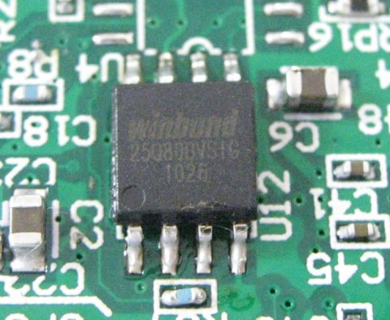

---

<a id="nahicopybit"></a>

## NahiCopyBit (Bitファイルを表に出す)

VivadoではBitStreamは、\<project>\<project>.runs\impl_1/<project>.bit という深いディレクトリにBitStreamが作られます。これをNahiVivaがあるディレクトリにコピーするのがこのコマンドです。
```
NahiCopyBit
```

もう、Bitファイルを探してフォルダの奥まで開く必要はありません。


---

## その他のバッチファイル
以下のバッチファイルも用意されています。

* open_vivado.cmd ・・・SETTINGS.CMDで指定されたバージョンのVivadoを開きます。
* build_project.cmd ・・・Vivadoをテキストモードで起動し、論理合成と配置配線のみ行います。起動が速やかで、メモリ使用量も若干少なくなります。
* delete_project.cmd ・・・Vivadoのプロジェクトフォルダをすべて削除します。
* open_project.cmd ・・・プロジェクトをテキストモードで開きます。

--- 
# Author
なひたふ Twitter: @nahitafu

特殊電子回路株式会社

# License
未定 (BSDかも)
